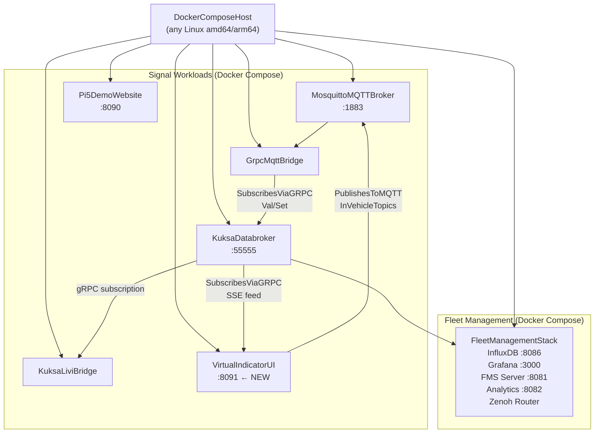

# Virtualization Plan: E2E Vehicle Signals Blueprint with Eclipse Winery & TOSCA

## 1. Objective

Fully virtualize the physical E2E Vehicle Signals blueprint so that the entire demo runs on any Linux host (or Docker Desktop) without any physical hardware. Eclipse Winery is used to create a TOSCA service topology that captures every component, its configuration, and its deployment relationships. Two new WebUI panels replace the physical driver-input ECUs (joystick + RFID) and the physical LED-strip actuator ECU.

---

## 2. What Gets Virtualized

| Physical Component | Role | Virtualization Strategy |
|-|-|-|
| Arduino Uno R4 WiFi #1 (Joystick ECU) | Indicator left/right + brake input | **Virtual Indicator Input WebUI** – browser buttons publish VSS JSON to MQTT |
| Arduino + RC522 RFID (Door ECU) | Driver identifier input | **Virtual Driver ID WebUI** – text field on same panel publishes driver subject to MQTT |
| Arduino Uno R4 WiFi #2 + MCP2515 (LED ECU) | CAN listener, drives 8-LED strip | **Virtual Indicator Actor WebUI** – animated 8-LED display subscribes to Kuksa Databroker via SSE/WebSocket |
| Raspberry Pi 5 hardware | Ubuntu compute node | **Docker Compose service stack** on any amd64/arm64 Linux host |
| Raspberry Pi 4 + LIVI head unit | IVI display + Android Auto | **LIVI panel tab** inside the existing demo website (Socket.IO iframe/embed), or eliminated in minimal mode |
| MXChip AZ3166 (ThreadX SOME/IP) | Optional SOME/IP bridge | Docker-based SOME/IP simulator (optional scope, not modelled in base topology) |

---

## 3. TOSCA / Eclipse Winery Modelling Approach

### 3.1 TOSCA Standard

Use **OASIS TOSCA Simple Profile in YAML Version 1.3** (`tosca_definitions_version: tosca_simple_yaml_1_3`).  
Eclipse Winery 3.x serves as the graphical topology modeller and CSAR package builder.

### 3.2 CSAR Package Layout

```
e2e-vehicle-signals-virtual.csar
├── TOSCA-Metadata/
│   └── TOSCA.meta                          # CSAR manifest
├── Definitions/
│   ├── service-template.yaml               # Top-level ServiceTemplate
│   ├── node-types.yaml                     # Custom node type definitions
│   └── relationship-types.yaml             # Custom relationship types
├── Scripts/
│   ├── deploy-compose.sh                   # docker compose up (lifecycle: configure)
│   └── teardown.sh                         # lifecycle: delete
├── Artifacts/
│   ├── docker-compose-virtual.yaml         # Full virtual stack compose file
│   ├── grpc-mqtt.yaml                      # Bridge config (injected at deploy)
│   ├── site-config.json                    # Website config (injected at deploy)
│   └── mosquitto.conf                      # Mosquitto config
└── Plans/
    └── deploy-plan.bpmn                    # Optional: Winery-generated BPMN plan
```

### 3.3 Node Type Hierarchy

```
tosca.nodes.Root
└── sdv.nodes.Container                        (abstract, adds: image, port_mappings, env)
    ├── sdv.nodes.MosquittoMQTTBroker          (port 1883)
    ├── sdv.nodes.KuksaDatabroker              (port 55555)
    ├── sdv.nodes.GrpcMqttBridge
    ├── sdv.nodes.KuksaLiviBridge
    ├── sdv.nodes.Pi5DemoWebsite               (port 8090)
    ├── sdv.nodes.VirtualIndicatorUI           (port 8091) ← NEW
    └── sdv.nodes.FleetManagementStack         (composite: FMS+Zenoh+InfluxDB+Grafana+Analytics)
sdv.nodes.DockerComposeHost                    (capability: Docker Engine 24+)
```

### 3.4 Relationship Types

| Relationship | From | To | Semantics |
|-|-|-|-|
| `sdv.relationships.PublishesToMQTT` | VirtualIndicatorUI | MosquittoMQTTBroker | WebUI sends MQTT messages |
| `sdv.relationships.SubscribesViaGRPC` | GrpcMqttBridge | KuksaDatabroker | bridge writes VSS values |
| `sdv.relationships.SubscribesViaGRPC` | VirtualIndicatorUI | KuksaDatabroker | actor panel reads VSS (SSE) |
| `sdv.relationships.ForwardsToFleet` | KuksaDatabroker | FleetManagementStack | Zenoh/uProtocol path |
| `tosca.relationships.HostedOn` | (all containers) | DockerComposeHost | |

---

## 4. Topology Diagram (Winery Canvas)



---

## 5. New Component: Virtual Indicator WebUI (:8091)

This single container replaces two physical ECUs (joystick input + LED actor) and augments the RFID door ECU.

### 5.1 Features

| Panel | Replaces | Implementation |
|-|-|-|
| **Indicator Input** | Joystick ECU (Arduino) | HTML buttons: Left ◄, Right ►, Brake ■, Off. Publishes VSS JSON to `InVehicleTopics` via WebSocket→MQTT or direct MQTT.js |
| **Driver ID Input** | RFID Door ECU (Arduino) | Text field + "Identify" button. Publishes `Vehicle.Driver.Identifier.Subject` |
| **Indicator Actor** | LED ECU (MCU1 + WS2812 strip) | Animated 8-LED strip SVG. Subscribes to Kuksa Databroker via SSE endpoint (`/api/sse/signals`) |

### 5.2 Technology Stack

- **Backend**: Python `api_server.py` (same pattern as `pi5-demo-website`) — extends the existing server with:
  - `POST /api/indicator` — receives button press, publishes to Mosquitto via `paho-mqtt`
  - `GET /api/sse/signals` — Server-Sent Events stream, polls Kuksa Databroker gRPC and pushes VSS values
- **Frontend**: Vanilla HTML/CSS/JS (same tech stack as existing `pi5-demo-website`):
  - `indicator-ui/index.html` — two-panel layout
  - `indicator-ui/styles.css` — LED strip animation (CSS keyframes)
  - `indicator-ui/app.js` — button handlers + SSE listener
- **Container**: New `Dockerfile` at `devices/virtual-indicator-ui/`
- **Port**: `8091` (avoids collision with existing `8090`)

### 5.3 LED Actor Panel Design

```
  ┌──────────────────────────────────────────┐
  │         Indicator Actor (Virtual)        │
  │                                          │
  │  ◄LEFT   [●][●][●][●][●][●][●][●]  RIGHT►│
  │           LED 1..4 = Left indicator      │
  │           LED 5..8 = Right indicator     │
  │           Center 4 blink amber on signal │
  │                                          │
  │  BRAKE:  [●][●][●][●][●][●][●][●]        │
  │           All 8 red when brake active    │
  └──────────────────────────────────────────┘
```

CSS classes `led--amber-blink`, `led--red`, `led--off` are toggled by the SSE handler in `app.js`.

---

## 6. TOSCA Service Template Skeleton

```yaml
tosca_definitions_version: tosca_simple_yaml_1_3

metadata:
  template_name: e2e-vehicle-signals-virtual
  template_version: "1.0.0"
  template_author: Eclipse SDV Blueprints Contributors
  description: >
    Full virtualization of the E2E Vehicle Signals blueprint.
    Replaces all physical ECUs with containerized or WebUI equivalents.
    Modelled with Eclipse Winery.

imports:
  - file: node-types.yaml
  - file: relationship-types.yaml

topology_template:
  inputs:
    host_ip:
      type: string
      default: "127.0.0.1"
    mqtt_port:
      type: integer
      default: 1883
    kuksa_port:
      type: integer
      default: 55555
    website_port:
      type: integer
      default: 8090
    indicator_ui_port:
      type: integer
      default: 8091

  node_templates:

    docker-host:
      type: sdv.nodes.DockerComposeHost
      properties:
        docker_version: ">=24.0"
        os_type: Linux

    mosquitto-broker:
      type: sdv.nodes.MosquittoMQTTBroker
      properties:
        port: { get_input: mqtt_port }
        config_file: { get_artifact: [SELF, mosquitto_conf] }
      artifacts:
        mosquitto_conf:
          type: tosca.artifacts.File
          file: Artifacts/mosquitto.conf
      requirements:
        - host: docker-host

    kuksa-databroker:
      type: sdv.nodes.KuksaDatabroker
      properties:
        port: { get_input: kuksa_port }
        vss_version: "4.2"
      requirements:
        - host: docker-host

    grpc-mqtt-bridge:
      type: sdv.nodes.GrpcMqttBridge
      properties:
        config_file: { get_artifact: [SELF, bridge_conf] }
      artifacts:
        bridge_conf:
          type: tosca.artifacts.File
          file: Artifacts/grpc-mqtt.yaml
      requirements:
        - host: docker-host
        - connects_to_mqtt: mosquitto-broker
        - connects_to_databroker: kuksa-databroker

    kuksa-livi-bridge:
      type: sdv.nodes.KuksaLiviBridge
      properties:
        config_file: { get_artifact: [SELF, livi_conf] }
      artifacts:
        livi_conf:
          type: tosca.artifacts.File
          file: Artifacts/grpc-livi.yaml
      requirements:
        - host: docker-host
        - connects_to_databroker: kuksa-databroker

    pi5-demo-website:
      type: sdv.nodes.Pi5DemoWebsite
      properties:
        port: { get_input: website_port }
        site_config: { get_artifact: [SELF, site_conf] }
      artifacts:
        site_conf:
          type: tosca.artifacts.File
          file: Artifacts/site-config.json
      requirements:
        - host: docker-host

    virtual-indicator-ui:                        # ← NEW node
      type: sdv.nodes.VirtualIndicatorUI
      properties:
        port: { get_input: indicator_ui_port }
        mqtt_topic: "InVehicleTopics"
        vss_paths:
          - "Vehicle.Body.Lights.DirectionIndicator.Left.IsSignaling"
          - "Vehicle.Body.Lights.DirectionIndicator.Right.IsSignaling"
          - "Vehicle.Body.Lights.Brake.IsActive"
          - "Vehicle.Driver.Identifier.Subject"
      requirements:
        - host: docker-host
        - publishes_to_mqtt: mosquitto-broker
        - subscribes_to_databroker: kuksa-databroker

    fleet-management-stack:
      type: sdv.nodes.FleetManagementStack
      properties:
        compose_file: "fms-blueprint-compose-zenoh.yaml"
        influxdb_port: 8086
        grafana_port: 3000
        fms_server_port: 8081
        analytics_port: 8082
      requirements:
        - host: docker-host
        - receives_from_databroker: kuksa-databroker

  outputs:
    demo_website_url:
      description: Live architecture / signal-flow dashboard
      value: { concat: ["http://", { get_input: host_ip }, ":", { get_input: website_port }] }
    indicator_ui_url:
      description: Virtual Indicator Input + Actor UI
      value: { concat: ["http://", { get_input: host_ip }, ":", { get_input: indicator_ui_port }] }
    grafana_url:
      description: Fleet telemetry dashboards
      value: { concat: ["http://", { get_input: host_ip }, ":3000"] }
    kuksa_databroker_endpoint:
      description: gRPC endpoint for direct VSS access
      value: { concat: [{ get_input: host_ip }, ":", { get_input: kuksa_port }] }
```

---

## 7. Node Type Definitions (`node-types.yaml`)

```yaml
tosca_definitions_version: tosca_simple_yaml_1_3

node_types:

  sdv.nodes.DockerComposeHost:
    derived_from: tosca.nodes.Compute
    properties:
      docker_version:
        type: string
        required: true
      os_type:
        type: string
        default: Linux
    capabilities:
      host:
        type: tosca.capabilities.Compute
        valid_source_types: [sdv.nodes.Container]

  sdv.nodes.Container:
    derived_from: tosca.nodes.Container.Application.Docker
    properties:
      image:
        type: string
        required: true
      network_mode:
        type: string
        default: host
      restart_policy:
        type: string
        default: always

  sdv.nodes.MosquittoMQTTBroker:
    derived_from: sdv.nodes.Container
    properties:
      port:
        type: integer
        default: 1883
      config_file:
        type: string
        required: false
    capabilities:
      mqtt_endpoint:
        type: tosca.capabilities.Endpoint
        properties:
          port: { get_property: [SELF, port] }
          protocol: tcp

  sdv.nodes.KuksaDatabroker:
    derived_from: sdv.nodes.Container
    properties:
      port:
        type: integer
        default: 55555
      vss_version:
        type: string
        default: "4.2"
    capabilities:
      grpc_endpoint:
        type: tosca.capabilities.Endpoint
        properties:
          port: { get_property: [SELF, port] }
          protocol: grpc

  sdv.nodes.GrpcMqttBridge:
    derived_from: sdv.nodes.Container
    properties:
      config_file:
        type: string
        required: true
    requirements:
      - connects_to_mqtt:
          capability: tosca.capabilities.Endpoint
          node: sdv.nodes.MosquittoMQTTBroker
          relationship: sdv.relationships.PublishesToMQTT
      - connects_to_databroker:
          capability: tosca.capabilities.Endpoint
          node: sdv.nodes.KuksaDatabroker
          relationship: sdv.relationships.SubscribesViaGRPC

  sdv.nodes.KuksaLiviBridge:
    derived_from: sdv.nodes.Container
    properties:
      config_file:
        type: string
        required: true
    requirements:
      - connects_to_databroker:
          capability: tosca.capabilities.Endpoint
          node: sdv.nodes.KuksaDatabroker
          relationship: sdv.relationships.SubscribesViaGRPC

  sdv.nodes.Pi5DemoWebsite:
    derived_from: sdv.nodes.Container
    properties:
      port:
        type: integer
        default: 8090
      site_config:
        type: string
        required: false
    capabilities:
      http_endpoint:
        type: tosca.capabilities.Endpoint
        properties:
          port: { get_property: [SELF, port] }
          protocol: http

  sdv.nodes.VirtualIndicatorUI:              # ← NEW node type
    derived_from: sdv.nodes.Container
    description: >
      Virtual replacement for the physical joystick ECU, RFID door ECU, and LED
      control ECU. Provides browser-based indicator input controls and an animated
      8-LED actor display. Input panel publishes VSS JSON to MQTT; actor panel
      subscribes to Kuksa Databroker via Server-Sent Events.
    properties:
      port:
        type: integer
        default: 8091
      mqtt_topic:
        type: string
        default: InVehicleTopics
      vss_paths:
        type: list
        entry_schema: { type: string }
        default:
          - "Vehicle.Body.Lights.DirectionIndicator.Left.IsSignaling"
          - "Vehicle.Body.Lights.DirectionIndicator.Right.IsSignaling"
          - "Vehicle.Body.Lights.Brake.IsActive"
          - "Vehicle.Driver.Identifier.Subject"
    capabilities:
      http_endpoint:
        type: tosca.capabilities.Endpoint
        properties:
          port: { get_property: [SELF, port] }
          protocol: http
    requirements:
      - publishes_to_mqtt:
          capability: tosca.capabilities.Endpoint
          node: sdv.nodes.MosquittoMQTTBroker
          relationship: sdv.relationships.PublishesToMQTT
      - subscribes_to_databroker:
          capability: tosca.capabilities.Endpoint
          node: sdv.nodes.KuksaDatabroker
          relationship: sdv.relationships.SubscribesViaGRPC

  sdv.nodes.FleetManagementStack:
    derived_from: tosca.nodes.Root
    description: Composite node covering the entire Fleet Management Docker Compose stack.
    properties:
      compose_file:
        type: string
        required: true
      influxdb_port:
        type: integer
        default: 8086
      grafana_port:
        type: integer
        default: 3000
      fms_server_port:
        type: integer
        default: 8081
      analytics_port:
        type: integer
        default: 8082
    capabilities:
      grafana_endpoint:
        type: tosca.capabilities.Endpoint
      fms_api_endpoint:
        type: tosca.capabilities.Endpoint
    requirements:
      - receives_from_databroker:
          capability: tosca.capabilities.Endpoint
          node: sdv.nodes.KuksaDatabroker
          relationship: sdv.relationships.ForwardsToFleet
```

---

## 8. Implementation Roadmap

### Phase 1 — Container Stack (1 day)

1. **Create `docker-compose-virtual.yaml`** that mirrors `vehicle-signals.yaml` workloads but uses Docker Compose semantics:
   - Services: `mosquitto`, `kuksa-databroker`, `grpc-mqtt-bridge`, `kuksa-livi-bridge`, `pi5-demo-website`.
   - All services share a custom Docker bridge network (`sdv-net`) instead of `--net=host`.

### Phase 2 — Virtual Indicator WebUI (2–3 days)

2. **Create `devices/virtual-indicator-ui/`** folder:
   - `api_server.py` — extends the existing Pi5 website server pattern:
     - `POST /api/indicator` → validates payload → publishes to Mosquitto via `paho-mqtt`
     - `GET /api/sse/signals` → SSE stream polling Kuksa Databroker gRPC every 200 ms
   - `index.html` — two-panel UI (Input panel + Actor panel)
   - `styles.css` — LED strip CSS animation (`@keyframes blink-amber`, `@keyframes all-red`)
   - `app.js` — button event handlers, SSE `EventSource` listener, LED state machine
   - `Dockerfile` — same base image as `pi5-demo-website`
   - `requirements.txt` — `paho-mqtt`, `kuksa-client`, `pyyaml`
3. **Add navigation link** from `pi5-demo-website` (port 8090) to the new UI (port 8091).
4. **Add `virtual-indicator-ui` service** to `docker-compose-virtual.yaml`.

### Phase 3 — TOSCA / Winery Modelling (1–2 days)

5. **Install Eclipse Winery** (Docker: `docker run -p 8080:8080 opentosca/winery:latest`).
6. **Import node types**: upload `node-types.yaml` and `relationship-types.yaml` into Winery's type repository.
7. **Build topology**: drag-and-drop all node templates from Section 6 onto the Winery canvas; connect with relationship arrows matching Section 3.4.
8. **Attach artifacts**: link `docker-compose-virtual.yaml` and all config files to their respective node templates in Winery.
9. **Export CSAR**: use Winery's "Package" action to generate `e2e-vehicle-signals-virtual.csar`.
10. **Validate with Winery's built-in consistency checker** (resolves missing capability/requirement pairs).

### Phase 4 — Deployment & Testing (1 day)

11. **Deploy from CSAR** using OpenTOSCA Container or the `winery-deploy` CLI:
    ```bash
    winery-deploy --csar e2e-vehicle-signals-virtual.csar \
                  --input host_ip=localhost
    ```
    This runs `deploy-compose.sh` (lifecycle: configure).
13. **Smoke test signal flow**:
    - Open `http://localhost:8091` → click **Left indicator ON** → verify `Vehicle.Body.Lights.DirectionIndicator.Left.IsSignaling` is `true` in the Kuksa Databroker and the actor panel shows amber-blinking left LEDs.
14. **Validate fleet pipeline**: check Grafana at `http://localhost:3000` for incoming VSS telemetry.

---

## 9. Eclipse Winery Setup

```bash
# Run Eclipse Winery with the OpenTOSCA stack (includes container + UI portal)
docker run -d \
  --name winery \
  -p 8080:8080 \
  opentosca/winery:latest

# Access Winery topology modeller
# http://localhost:8080/winery

# Import TOSCA type definitions
curl -X POST http://localhost:8080/winery/nodetypes \
  -H "Content-Type: application/yaml" \
  --data-binary @Definitions/node-types.yaml
```

The Winery canvas will show the full topology from Section 4 as a visual graph with coloured node icons, allowing drag-to-connect relationship editing and in-place property editing.

---

## 10. Key Design Decisions

| Decision | Rationale |
|-|-|
| **Separate port 8091** for the indicator UI | Avoids touching the existing `pi5-demo-website` while keeping it linkable via a nav button. |
| **SSE (Server-Sent Events) instead of WebSocket** | Simpler server-side implementation with Python's stdlib HTTP server (same pattern as existing `api_server.py`), no extra WebSocket library needed. |
| **MQTT publish path kept identical** | The virtual UI publishes to `InVehicleTopics` with the same VSS JSON schema the physical joystick ECU uses, so `grpc-mqtt-bridge` requires zero changes. |
| **Single TOSCA ServiceTemplate** | All components in one topology; Fleet Management is a composite node to keep the canvas readable. |
| **TOSCA Simple Profile 1.3** | Widest Winery support; avoids TOSCA 2.0 features not yet fully implemented in Winery 3.x. |

---

## 11. File Locations After Implementation

```
e2e-vehicle-signals/
├── devices/
│   ├── virtual-indicator-ui/          ← NEW
│   │   ├── Dockerfile
│   │   ├── api_server.py
│   │   ├── index.html
│   │   ├── styles.css
│   │   ├── app.js
│   │   └── requirements.txt
│   └── raspberry-pi5/
│       └── ankaios/
│           └── vehicle-signals.yaml   (unchanged — physical path)
├── tosca/                             ← NEW
│   ├── e2e-vehicle-signals-virtual.csar
│   ├── Definitions/
│   │   ├── service-template.yaml
│   │   ├── node-types.yaml
│   │   └── relationship-types.yaml
│   ├── Scripts/
│   │   ├── deploy-compose.sh
│   │   └── teardown.sh
│   └── Artifacts/
│       ├── docker-compose-virtual.yaml
│       ├── grpc-mqtt.yaml
│       ├── grpc-livi.yaml
│       ├── mosquitto.conf
│       └── site-config.json
└── docs/
    └── virtualization-plan-tosca-winery.md  ← THIS FILE
```
