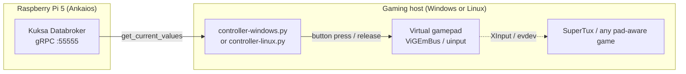

# Kuksa → Virtual Gamepad Bridge

The **Kuksa-to-Gamepad bridge** turns live VSS signals into a virtual Xbox‑style controller, so any game that accepts a standard gamepad (such as **SuperTux**) can be driven by the same demo signals the rest of the blueprint uses.

It complements the [Kuksa-to-LIVI Telemetry Bridge](./bridge-kuksa-livi.md) and the [MQTT-to-Kuksa gRPC Bridge](./bridge-mqtt-grpc.md) as a third consumer of the central databroker.

Two platform-specific entry points are provided — pick the one matching the host where the game runs:

| Script | Platform | Backend |
| --- | --- | --- |
| `controller-windows.py` | Windows 10 / 11 | [`vgamepad`](https://pypi.org/project/vgamepad/) + [ViGEmBus](https://github.com/nefarius/ViGEmBus) (virtual Xbox 360) |
| `controller-linux.py`   | Linux           | [`evdev`](https://python-evdev.readthedocs.io/) + `/dev/uinput` (Xbox-style HID) |

Both scripts share the same CLI flags, the same VSS mapping, and the same exponential‑backoff reconnect logic.

Source: [`devices/ivi/grpc-to-gamecontroller/`](https://github.com/eclipse-sdv-blueprints/e2e-vehicle-signals/tree/main/devices/ivi/grpc-to-gamecontroller)

## Role in the system



## Signal mapping

| VSS path | Gamepad action |
| --- | --- |
| `Vehicle.Body.Lights.DirectionIndicator.Left.IsSignaling` | D-Pad **LEFT** held while `true` |
| `Vehicle.Body.Lights.DirectionIndicator.Right.IsSignaling` | D-Pad **RIGHT** held while `true` |
| `Vehicle.Body.Lights.Brake.IsActive` | **X** button held while `true` |

Edge-detected: a press / release is only sent when a signal actually changes, so a turn-indicator pulse keeps the D-Pad held for the full duration of the VSS state.

## Requirements

- **Python 3.10+** on the host running the bridge.
- Network reach to the Pi 5's Kuksa Databroker (default `192.168.88.100:55555`).
- **Windows variant:** the [ViGEmBus driver](https://github.com/nefarius/ViGEmBus/releases) installed (one-time, reboot required).
- **Linux variant:** the `uinput` kernel module loaded and `/dev/uinput` writable by the running user (see [Linux setup](#linux-setup) below).

## Install

### Windows

```powershell
cd devices\ivi\grpc-to-gamecontroller
python -m venv .venv
.\.venv\Scripts\Activate.ps1
pip install -r requirements.txt
```

### Linux

```bash
cd devices/ivi/grpc-to-gamecontroller
python3 -m venv .venv
source .venv/bin/activate
pip install -r requirements.txt
```

`requirements.txt` uses PEP‑508 platform markers, so `vgamepad` is only pulled in on Windows and `evdev` only on Linux.

### Linux setup

Allow your user to open `/dev/uinput` without `sudo`:

```bash
sudo modprobe uinput
echo 'KERNEL=="uinput", MODE="0660", GROUP="input", OPTIONS+="static_node=uinput"' \
  | sudo tee /etc/udev/rules.d/99-uinput.rules
sudo udevadm control --reload-rules && sudo udevadm trigger
sudo usermod -aG input "$USER"   # log out + back in for this to take effect
```

To persist the `uinput` module across reboots, add it to `/etc/modules-load.d/uinput.conf`.

### Install SuperTux (demo target game)

On Debian / Ubuntu / Raspberry Pi OS:

```bash
sudo apt update
sudo apt install supertux
```

On Windows:

```powershell
winget install SuperTuxTeam.SuperTux
```

Inside SuperTux, open **Options → Controls → Joystick** once and re-bind actions to the virtual gamepad device (it appears as `Xbox 360 Controller for Windows` on Windows and `Kuksa Virtual Gamepad` on Linux). Confirm the D-Pad and `X` button are detected.

## Run

Windows:

```powershell
python controller-windows.py --host 192.168.88.100 --port 55555 --verbose
```

Linux:

```bash
python controller-linux.py --host 192.168.88.100 --port 55555 --verbose
```

CLI flags (identical for both scripts):

| Flag | Default | Description |
| --- | --- | --- |
| `-th`, `--host` | `localhost` | Kuksa Databroker hostname / IP |
| `-tp`, `--port` | `55555` | Kuksa Databroker port |
| `-i`, `--interval` | `0.05` | Poll interval in seconds |
| `--verbose` | off | Log every signal state change |
| `--reconnect-delay` | `2.0` | Initial reconnect back-off in seconds |
| `--reconnect-delay-max` | `30.0` | Maximum reconnect back-off in seconds |

## Connection stability

The bridge **never exits** because the databroker isn't up yet:

- On startup, if `client.connect()` fails it logs `Kuksa connect failed (…) — retrying in Xs` and waits.
- Back-off is **exponential** (×2 per failure) and capped at `--reconnect-delay-max`; it resets to `--reconnect-delay` on every successful connect.
- If the gRPC connection drops mid-run it logs `Kuksa connection lost (…) — retrying in Xs` and reconnects.
- Between reconnects the virtual gamepad is reset, so a transient outage cannot leave the indicator D-Pad or the `X` button latched.

This mirrors the connection behaviour of the [Kuksa-to-LIVI Telemetry Bridge](./bridge-kuksa-livi.md), so the controller bridge can be started in any order relative to the databroker.

## Troubleshooting

### Windows

- **`OSError: ViGEmBus is not installed`** — install the driver from <https://github.com/nefarius/ViGEmBus/releases> and reboot.
- **Buttons stay stuck after an abnormal exit** — re-run the script and exit cleanly with `Ctrl-C` (clean exit calls `gamepad.reset()`), or unplug/replug the virtual device via Device Manager.

### Linux

- **`PermissionError: [Errno 13] Permission denied: '/dev/uinput'`** — apply the udev rule from [Linux setup](#linux-setup), or run with `sudo` as a quick check. Re-login after `usermod -aG input`.
- **`FileNotFoundError: /dev/uinput`** — load the kernel module: `sudo modprobe uinput`.
- **Game doesn't see a gamepad** — verify the virtual device exists (`ls /dev/input/by-id/ | grep -i kuksa` or `evtest`) and that SDL / the game picks it up.

### Both

- **Gamepad detected but no input in-game** — bind the gamepad inside the game's controls menu; some games need the controller plugged in *before* startup.
- **Connect log loop with no recovery** — confirm the Pi 5's databroker is exposing `:55555` on the LAN (`ss -ltn | grep 55555`) and that the host can reach it (`Test-NetConnection 192.168.88.100 -Port 55555` on Windows, `nc -zv 192.168.88.100 55555` on Linux).

## Related pages

- [Architecture](./architecture.md)
- [Signal Mapping](./signal-mapping.md)
- [IVI Head Unit (LIVI)](./device-ivi-livi.md)
- [Kuksa-to-LIVI Telemetry Bridge](./bridge-kuksa-livi.md)
- [MQTT-to-Kuksa gRPC Bridge](./bridge-mqtt-grpc.md)
