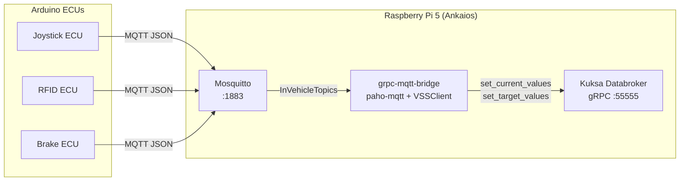

# MQTT-to-Kuksa gRPC Bridge

The **MQTT-to-Kuksa gRPC Bridge** (`grpc-mqtt-bridge`) is the ingest path that turns JSON messages published by the Arduino ECUs (joystick, RFID, brake) into VSS datapoints in the Kuksa Databroker. It runs as an Ankaios workload on the **Raspberry Pi 5** next to the broker and databroker.

Source: [`devices/raspberry-pi5/grpc-mqtt-bridge/`](https://github.com/eclipse-sdv-blueprints/e2e-vehicle-signals/tree/main/devices/raspberry-pi5/grpc-mqtt-bridge)

## Role in the system



The bridge is a small Python service that:

1. Connects to the local Mosquitto broker and subscribes to one or more topics (default: `InVehicleTopics`).
2. On every message, parses the JSON payload, extracts values via [RFC 6901 JSON pointers](https://www.rfc-editor.org/rfc/rfc6901), and coerces them to the target VSS scalar type.
3. Writes the resulting datapoints to the Kuksa Databroker via gRPC, automatically routing **`ACTUATOR`** entries to `set_target_values` and all other entry types to `set_current_values`.

## Configuration

The runtime config lives in [`devices/raspberry-pi5/ankaios/grpc-mqtt.yaml`](https://github.com/eclipse-sdv-blueprints/e2e-vehicle-signals/tree/main/devices/raspberry-pi5/ankaios/grpc-mqtt.yaml) and is mounted into the container by the Ankaios manifest.

### Top-level layout

```yaml
mqtt:
  broker: "tcp://192.168.88.100:1883"
  clientId: "kuksa-mqtt-bridge"
  subscriptions:
    - topic: "InVehicleTopics"
      qos: 0
grpc:
  target: "192.168.88.100:55555"
mappings:
  - name: "joystick-vss-update"
    mqtt:
      topic: "InVehicleTopics"
      jsonPointer: "/"
    grpc:
      updates:
        - path: "Vehicle.Body.Lights.DirectionIndicator.Left.IsSignaling"
          type: "bool"
          jsonPointer: "/Vehicle.Body.Lights.DirectionIndicator.Left.IsSignaling"
```

### `mqtt`

| Key | Required | Description |
| --- | --- | --- |
| `broker` | yes | Broker URL — `tcp://host:port` or `mqtt://host:port` |
| `clientId` | no | MQTT client identifier (default: `kuksa-mqtt-bridge`) |
| `subscriptions[].topic` | yes | Topic filter to subscribe to |
| `subscriptions[].qos` | no | MQTT QoS level (default: `0`) |

### `grpc`

| Key | Required | Description |
| --- | --- | --- |
| `target` | yes | Kuksa Databroker `host:port` (default: `localhost:55555`) |

### `mappings[]`

Each mapping connects one MQTT topic to one or more VSS datapoints.

| Key | Required | Description |
| --- | --- | --- |
| `name` | no | Human-readable label (logging only) |
| `mqtt.topic` | yes | Exact topic this mapping reacts to |
| `mqtt.jsonPointer` | no | JSON pointer scoping the payload before per-update extraction (default: `/`) |
| `grpc.updates[].path` | yes | Fully qualified VSS path to write (e.g. `Vehicle.Speed`) |
| `grpc.updates[].jsonPointer` | yes | JSON pointer into the scoped payload picking the value |
| `grpc.updates[].type` | no | Target scalar type: `bool`, `int`, `float`, `string` |

VSS metadata (data type, value restriction, entry type) is fetched lazily on first use and cached, so string-typed booleans, enum-restricted strings, and numeric arrays are coerced to the exact representation the databroker expects.

## Default signal mapping

The shipped `grpc-mqtt.yaml` forwards the following keys from `InVehicleTopics` into VSS:

| MQTT JSON pointer | VSS path | Type | Origin |
| --- | --- | --- | --- |
| `/Vehicle.Body.Lights.DirectionIndicator.Left.IsSignaling` | `Vehicle.Body.Lights.DirectionIndicator.Left.IsSignaling` | `bool` | Joystick ECU |
| `/Vehicle.Body.Lights.DirectionIndicator.Right.IsSignaling` | `Vehicle.Body.Lights.DirectionIndicator.Right.IsSignaling` | `bool` | Joystick ECU |
| `/Vehicle.Body.Lights.Brake.IsActive` | `Vehicle.Body.Lights.Brake.IsActive` | `string` | Brake ECU |
| `/Vehicle.Driver.Identifier.Subject` | `Vehicle.Driver.Identifier.Subject` | `string` | RFID ECU |

See [Signal Mapping](./signal-mapping.md) for the full chain ECU → MQTT → VSS → CAN/LED/LIVI.

## Container

The bridge ships as a small `python:3.11-slim` image. The published image is available at:

```text
ghcr.io/<owner>/e2e-vehicle-signals/grpc-mqtt-bridge:main
```

Built locally:

```bash
podman build -t grpc-mqtt-bridge:latest devices/raspberry-pi5/grpc-mqtt-bridge
```

Run standalone for debugging:

```bash
docker run --rm --net=host \
  -v $(pwd)/devices/raspberry-pi5/ankaios/grpc-mqtt.yaml:/config/grpc-mqtt.yaml:ro \
  grpc-mqtt-bridge:latest --config /config/grpc-mqtt.yaml
```

## Troubleshooting

- **"Skipping non-JSON MQTT payload"** — A subscriber received a message that wasn't valid JSON; check the publishing ECU.
- **No VSS update visible via `kuksa-client`** — Confirm `grpc.target` is reachable from inside the bridge container and that the VSS path is registered with the databroker (see [`vehicle-signals.yaml`](https://github.com/eclipse-sdv-blueprints/e2e-vehicle-signals/tree/main/devices/raspberry-pi5/ankaios/vehicle-signals.yaml)).
- **Type conversion errors** — Use the explicit `type:` field on each update; the bridge will silently skip values it can't coerce.
- **Broker drops** — Paho's built-in reconnect logic (`loop_forever()`) recovers automatically; no extra configuration needed.

## Related pages

- [Architecture](./architecture.md) — full workload table including this bridge.
- [Communication Workflow](./communication-workflow.md) — end-to-end sequence including the MQTT → gRPC step.
- [Signal Mapping](./signal-mapping.md) — VSS path catalogue and downstream consumers.
- [IVI Head Unit (LIVI)](./device-ivi-livi.md) — sister bridge in the opposite direction (gRPC → Socket.IO).
