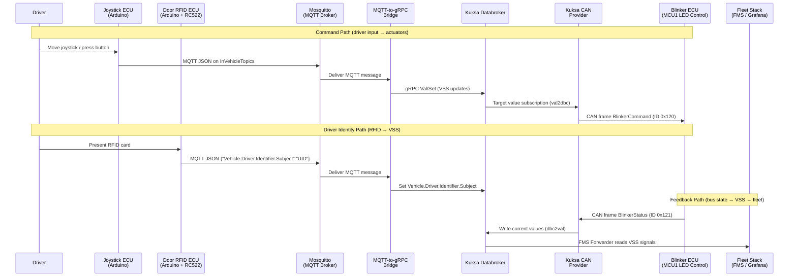

# Communication Workflow

This page describes the end-to-end signal flow through the demo system — from driver input to physical LED actuation and back.

## Signal Flow Overview



## Detailed Data Paths

### 1. Command Path — Joystick to LEDs

This is the primary signal path that turns driver input into physical LED output:

```
Joystick sensor (analog)
  → Arduino sketch reads X/Y/button
    → JSON payload published to MQTT topic "InVehicleTopics"
      → Mosquitto delivers to grpc-mqtt-bridge
        → Bridge extracts VSS values via JSON pointers
          → gRPC Val/Set to Kuksa Databroker (target values)
            → Kuksa CAN Provider subscribes to target values (val2dbc)
              → CAN frame BlinkerCommand (ID 0x120) emitted on SocketCAN
                → MCP2515 receives on Arduino LED ECU
                  → Arduino parses bit field and drives WS2812 LEDs
```

**Latency**: Typically < 100 ms end-to-end over Wi-Fi + CAN for the blinker command.

### 2. Driver Identity Path — RFID to VSS

```
RFID card tap on RC522 reader
  → Arduino sketch reads UID bytes
    → JSON payload {"Vehicle.Driver.Identifier.Subject": "A1B2C3D4"}
      → Published to MQTT topic "InVehicleTopics"
        → Bridge writes to Kuksa Databroker (string value)
          → FMS Forwarder maps to telemetry field "driver1Id"
            → Stored in InfluxDB → visible in Grafana "Driver Identifier (RFID)" panel
```

### 3. Feedback Path — CAN Status to VSS

The LED control ECU reports its current state back to the system:

```
Arduino LED ECU applies blinker/brake state
  → Encodes current state as CAN frame BlinkerStatus (ID 0x121)
    → Kuksa CAN Provider reads from SocketCAN (dbc2val)
      → Writes current values to Kuksa Databroker
        → Available to all VSS subscribers (Fleet, UI, CLI)
```

### 4. ThreadX SOME/IP Relay Path (Optional)

```
Mosquitto → AZ3166 Device 1 (MQTT subscriber)
  → Parses direction + brake from MQTT payload
    → Publishes via SOME/IP over Wi-Fi (UDP)
      → AZ3166 Device 2 receives event
        → Updates LED / OLED / UI display

AZ3166 Device 1 ↔ AZ3166 Device 2
  → Bidirectional button state sync via SOME/IP
```

## MQTT Topic Structure

All in-vehicle VSS signal updates flow through a single MQTT topic:

| Topic | Publisher | Subscriber | Payload |
| --- | --- | --- | --- |
| `InVehicleTopics` | Joystick ECU, RFID ECU | MQTT-to-gRPC Bridge | JSON with VSS path keys |
| `InVehicleTopics` | Joystick ECU | AZ3166 Device 1 (optional) | Same JSON payload |

## Bridge Mapping Configuration

The `grpc-mqtt.yaml` configuration defines how MQTT payloads are mapped to Kuksa gRPC updates:

```yaml
mappings:
  - name: "joystick-vss-update"
    mqtt:
      topic: "InVehicleTopics"
      jsonPointer: "/"
    grpc:
      updates:
        - path: "Vehicle.Body.Lights.DirectionIndicator.Left.IsSignaling"
          type: "bool"
          jsonPointer: "/Vehicle.Body.Lights.DirectionIndicator.Left.IsSignaling"
        - path: "Vehicle.Body.Lights.DirectionIndicator.Right.IsSignaling"
          type: "bool"
          jsonPointer: "/Vehicle.Body.Lights.DirectionIndicator.Right.IsSignaling"
        - path: "Vehicle.Body.Lights.Brake.IsActive"
          type: "string"
          jsonPointer: "/Vehicle.Body.Lights.Brake.IsActive"
        - path: "Vehicle.Driver.Identifier.Subject"
          type: "string"
          jsonPointer: "/Vehicle.Driver.Identifier.Subject"
```

Each mapping entry specifies:

- **MQTT topic and JSON pointer** to extract the root or a sub-object from the payload
- **gRPC updates** with the VSS path, expected data type, and JSON pointer within the extracted object

The bridge queries Kuksa Databroker metadata to determine whether each VSS path is a **sensor** or **actuator** and routes the value to the appropriate field (current value vs. target value).

## LED Blinking Behavior

The LED control Arduino implements the following visual behavior:

| Signal State | LED Behavior |
| --- | --- |
| Left indicator ON | LEDs 0–1 blink at 1 Hz (500 ms on/off) |
| Right indicator ON | LEDs 6–7 blink at 1 Hz (500 ms on/off) |
| Brake ACTIVE | LEDs 3–4 solid on |
| All OFF | All LEDs off |
