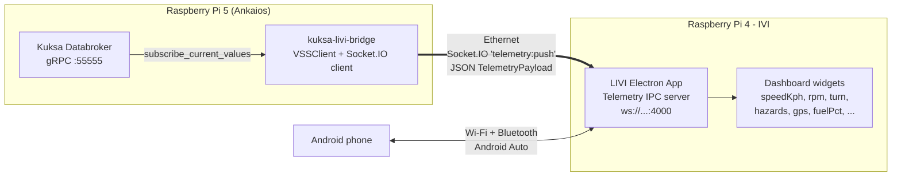
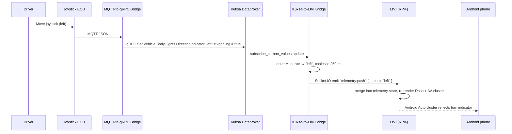

# IVI Head Unit (LIVI)

The demo includes an optional **In-Vehicle Infotainment (IVI)** subsystem running on a dedicated **Raspberry Pi 4** with a **7-inch touchscreen**. It hosts [LIVI](https://github.com/f-io/LIVI) — an open-source Apple CarPlay & Android Auto head unit built on Electron — and is wired into the rest of the demo via an **Ethernet** cable to the Raspberry Pi 5.

A new Ankaios workload, the **Kuksa-to-LIVI Telemetry Bridge** (`kuksa-livi-bridge`), runs alongside the other signal workloads on the Pi 5 and feeds live VSS values from the Kuksa Databroker into the LIVI dashboard.

## Hardware

| Item | Notes |
| --- | --- |
| Raspberry Pi 4 (4 GB+) | Runs **Raspberry Pi OS Trixie** (required by LIVI for WebGL2) |
| 7" DSI / HDMI touchscreen | Boots LIVI fullscreen in kiosk mode |
| Ethernet cable | Connects to the Pi 5 / demo switch (`192.168.88.110`) |
| Built-in Wi-Fi + Bluetooth | Used to pair an **Android smartphone** for wireless Android Auto |
| Optional Carlinkit CPC200-CCPA dongle | Adds wireless Apple CarPlay support |

LIVI is installed on the Pi 4 with the upstream installer:

```bash
curl -fL -o install.sh \
  https://raw.githubusercontent.com/f-io/LIVI/main/scripts/install/pi/install.sh
chmod +x install.sh
./install.sh
```

## Component overview



## Kuksa-to-LIVI Telemetry Bridge

The bridge is a small Python service (mirrored after the existing `grpc-mqtt-bridge`) that:

1. Opens a gRPC connection to the Kuksa Databroker using the official [`kuksa-client`](https://github.com/eclipse-kuksa/kuksa-python-sdk) `VSSClient`.
2. Subscribes to a configurable list of VSS paths via `subscribe_current_values(...)`.
3. Looks up each updated path in its mapping table and applies an optional **enum map**, **scale/offset**, and **type coercion**.
4. Merges the result into a [`TelemetryPayload`](https://github.com/f-io/LIVI/blob/main/src/main/shared/types/Telemetry.ts) JSON object — including nested keys such as `gps.lat`.
5. Coalesces all changes inside a sliding window (default **250 ms**) and pushes them as a single batched event to LIVI's Socket.IO endpoint (`ws://<livi-host>:4000`, event `telemetry:push`).

This matches the same wire-format that LIVI's own `pnpm -C scripts/tools run telemetry:set …` CLI uses:

```bash
# What the CLI does:                       What the bridge sends:
pnpm telemetry:set turn=left            →  { "ts": 1717238400000, "turn": "left" }
pnpm telemetry:set gps.lat=53.59 \      →  { "ts": ..., "gps": { "lat": 53.59,
                  gps.lng=10.01                              "lng": 10.01 } }
pnpm telemetry:set _repeatMs=1000 \     →  controlled by bridge `push.intervalMs`
                  speedKph=90 rpm=2500
```

Source: [`devices/raspberry-pi5/grpc-to-LIVI-telemetry-bridge/bridge.py`](https://github.com/eclipse-sdv-blueprints/e2e-vehicle-signals/tree/main/devices/raspberry-pi5/grpc-to-LIVI-telemetry-bridge)

### Container image

The bridge is published as a multi-arch (`linux/amd64`, `linux/arm64`) OCI image via the GitHub Actions workflow `publish-kuksa-livi-bridge.yml`:

```
ghcr.io/<owner>/e2e-vehicle-signals/kuksa-livi-bridge:main
```

It is launched on the Pi 5 by Ankaios as the `kuksa-livi-bridge` workload (see `vehicle-signals.yaml`) with `--net=host`, so it reaches both the local Databroker (`localhost:55555`) and the IVI Pi 4 (`192.168.88.110:4000`) over the wired link.

## Signal mapping: VSS → LIVI `TelemetryPayload`

The mapping table lives in [`devices/raspberry-pi5/ankaios/grpc-livi.yaml`](https://github.com/eclipse-sdv-blueprints/e2e-vehicle-signals/tree/main/devices/raspberry-pi5/ankaios/grpc-livi.yaml). Each entry has a `vssPath`, a dotted `liviField`, and optional `type` / `enumMap` / `scale` / `offset` transforms.

### Default mappings (demo signals)

| VSS path (Kuksa, gRPC) | LIVI field | Type | Transform | Notes |
| --- | --- | --- | --- | --- |
| `Vehicle.Body.Lights.DirectionIndicator.Left.IsSignaling` *and* `…Right.IsSignaling` | `turn` | `string` | **composite** | Both booleans feed a single `turn` enum (`'left'` / `'right'` / `'none'`) via the `composites:` block — see [Composites](#composites--derived-fields-from-multiple-vss-inputs) below. |
| `Vehicle.Body.Lights.Brake.IsActive` | `hazards` | `bool` | `INACTIVE/ACTIVE → false`, `ADAPTIVE → true` | LIVI hazards bool — flashes on emergency braking |
| `Vehicle.Driver.Identifier.Subject` | `driverId` | `string` | identity | Custom extension field (`TelemetryPayload`'s open `[key: string]: unknown`) |

### Fleet Management telemetry signals (csv-provider)

When the Fleet Management blueprint is running, the [`csv-provider`](https://github.com/eclipse-sdv-blueprints/fleet-management/tree/main/csv-provider) replays the recording in [`signalsFmsRecording.csv`](https://github.com/eclipse-sdv-blueprints/e2e-vehicle-signals/blob/main/external/fleet-management/csv-provider/signalsFmsRecording.csv) into the Kuksa Databroker. The bridge picks every one of those signals up over gRPC and forwards them to LIVI:

| # | VSS path (from `csv-provider`) | LIVI field | Type | Transform | Notes |
| --- | --- | --- | --- | --- | --- |
| 1 | `Vehicle.VehicleIdentification.VIN` | `vin` | `string` | identity | Custom extension field — displayed in LIVI "About vehicle" |
| 2 | `Vehicle.Speed` | `speedKph` | `float` | identity | Primary cluster speed (km/h) |
| 3 | `Vehicle.Tachograph.VehicleSpeed` | `gps.speedMs` | `float` | `scale: 0.27778` | Tachograph reports km/h; LIVI's `gps.speedMs` is m/s (`÷ 3.6`). AA prefers this over `speedKph` |
| 4 | `Vehicle.Powertrain.CombustionEngine.Speed` | `rpm` | `int` | identity | Engine RPM |
| 5 | `Vehicle.Powertrain.FuelSystem.Tank.First.RelativeLevel` | `fuelPct` | `float` | identity | Already in 0..100 % |
| 6 | `Vehicle.Powertrain.CombustionEngine.DieselExhaustFluid.Level` | `defLevelPct` | `float` | identity | Custom extension — AdBlue / DEF level |
| 7 | `Vehicle.Powertrain.CombustionEngine.EngineHours` | `engineHours` | `float` | identity | Custom extension — operating hours |
| 8 | `Vehicle.Chassis.ParkingBrake.IsEngaged` | `parkingBrake` | `bool` | identity | Native LIVI boolean, routed Dash + AA |
| 9 | `Vehicle.Exterior.AirTemperature` | `ambientC` | `float` | identity | LIVI also forwards to AA env channel |
| 10 | `Vehicle.TraveledDistanceHighRes` | `odometerKm` | `float` | `scale: 0.001` | FMS reports metres (5 m resolution) → LIVI odometer in km |
| 11 | `Vehicle.CurrentOverallWeight` | `weightKg` | `float` | identity | Custom extension — gross vehicle weight |
| 12 | `Vehicle.Tachograph.Driver.Driver1.WorkingState` | `driver1State` | `string` | identity | Custom extension — `REST` / `DRIVER_AVAILABLE` / `WORK` / `DRIVE` |
| 13 | `Vehicle.Tachograph.Driver.Driver2.WorkingState` | `driver2State` | `string` | identity | Custom extension |
| 14 | `Vehicle.Tachograph.Driver.Driver1.IsCardPresent` | `driver1CardPresent` | `bool` | identity | Custom extension |
| 15 | `Vehicle.Tachograph.Driver.Driver2.IsCardPresent` | `driver2CardPresent` | `bool` | identity | Custom extension |

> All `Vehicle.Tachograph.…` and `Vehicle.VehicleIdentification.VIN`, `Vehicle.CurrentOverallWeight`, `Vehicle.Powertrain.CombustionEngine.DieselExhaustFluid.Level`, `Vehicle.Powertrain.CombustionEngine.EngineHours` fields land in LIVI's open `[key: string]: unknown` extension slot. LIVI's Dashboard merges them into its central store like any other field, so they can be surfaced by custom widgets without breaking the upstream `TelemetryPayload` contract.

### Optional extended cluster mapping

Beyond the demo and FMS signals above, LIVI's `TelemetryPayload` (see [`Telemetry.ts`](https://github.com/f-io/LIVI/blob/main/src/main/shared/types/Telemetry.ts)) exposes additional cluster fields. The bridge supports them out of the box — wire them up by adding new entries to `grpc-livi.yaml` once the corresponding VSS signals are produced:

| LIVI field | LIVI route (Dash / AA / Dongle) | Suggested VSS source | Transform |
| --- | --- | --- | --- |
| `speedKph` | ✓ ✓ · | `Vehicle.Speed` | `type: float` |
| `rpm` | ✓ ✓ · | `Vehicle.Powertrain.CombustionEngine.Speed` | `type: int` |
| `gear` | ✓ ✓ · | `Vehicle.Powertrain.Transmission.SelectedGear` | identity (string or int) |
| `reverse` | ✓ ✓ · | derived from `gear == -1` | LIVI auto-derives if `gear` is sent |
| `lights` | ✓ ✓ · | `Vehicle.Body.Lights.Beam.Low.IsOn` | `type: bool` |
| `highBeam` | ✓ ✓ · | `Vehicle.Body.Lights.Beam.High.IsOn` | `type: bool` |
| `parkingBrake` | ✓ ✓ · | `Vehicle.Chassis.ParkingBrake.IsEngaged` | `type: bool` |
| `fuelPct` | ✓ ✓ · | `Vehicle.Powertrain.FuelSystem.Level` | `type: float` |
| `rangeKm` | ✓ ✓ · | `Vehicle.Powertrain.FuelSystem.Range` | `scale: 0.001` (VSS = m, LIVI = km) |
| `coolantC` | ✓ · · | `Vehicle.Powertrain.CombustionEngine.ECT` | `type: float` |
| `ambientC` | ✓ ✓ · | `Vehicle.Exterior.AirTemperature` | `type: float` |
| `batteryV` | ✓ · · | `Vehicle.LowVoltageBattery.CurrentVoltage` | `type: float` |
| `odometerKm` | ✓ ✓ · | `Vehicle.TraveledDistance` | `scale: 0.001` |
| `gps.lat` | ✓ ✓ ✓ | `Vehicle.CurrentLocation.Latitude` | `type: float` |
| `gps.lng` | ✓ ✓ ✓ | `Vehicle.CurrentLocation.Longitude` | `type: float` |
| `gps.alt` | ✓ ✓ · | `Vehicle.CurrentLocation.Altitude` | `type: float` |
| `gps.heading` | ✓ ✓ · | `Vehicle.CurrentLocation.Heading` | `type: float` |
| `gps.speedMs` | ✓ ✓ · | derived from `Vehicle.Speed / 3.6` | LIVI prefers this over `speedKph` for AA |
| `nightMode` | ✓ ✓ ✓ | `Vehicle.Cabin.Light.AmbientLight.IsLightOn` (or similar) | `type: bool` |
| `ts` | ✓ · · | bridge injects `int(time.time() * 1000)` | Always added if absent |

The routing column comes directly from the `TELEMETRY_ROUTES` table in [`Telemetry.ts`](https://github.com/f-io/LIVI/blob/main/src/main/shared/types/Telemetry.ts) — `✓ = consumed`, `· = ignored by that receiver`.

### Nested fields

LIVI shallow-merges sub-blocks such as `gps` and `can`. The bridge supports dotted `liviField` notation, so:

```yaml
- vssPath: Vehicle.CurrentLocation.Latitude
  liviField: gps.lat
  type: float
- vssPath: Vehicle.CurrentLocation.Longitude
  liviField: gps.lng
  type: float
```

produces a payload of the shape `{ "gps": { "lat": ..., "lng": ... } }` — exactly what LIVI's `GpsPayload` expects.

### Value transforms

| Field in `mappings` | Order applied | Purpose |
| --- | --- | --- |
| `enumMap` | 1 | Map a categorical VSS value (bool, string enum, int) to a LIVI enum (e.g. `'ADAPTIVE' → true`). |
| `scale` | 2 | Multiply numeric values (e.g. metres → kilometres with `0.001`). |
| `offset` | 2 | Additive offset applied after `scale`. |
| `type` | 3 | Final cast (`bool`, `int`, `float`, `string`). For `bool` from strings, `"ACTIVE" / "ADAPTIVE" / "true" / "1" / "yes" / "on"` resolve to `true`. |
| `skipValues` | pre-1 | Raw VSS values that suppress the push entirely — useful to drop noisy `false` edges that would otherwise clobber a shared LIVI field. |

`null` / missing VSS values are skipped by default to avoid clobbering known LIVI state; set `sendNone: true` on a mapping to forward them anyway.

### Composites — derived fields from multiple VSS inputs

Some LIVI fields are best computed jointly from several VSS paths — the canonical
example is `turn`, which combines both `DirectionIndicator.*.IsSignaling` booleans
into a single `'left' | 'right' | 'none'` enum without one side clobbering the
other. The bridge supports this through the top-level `composites:` block in
`grpc-livi.yaml`:

```yaml
composites:
  - liviField: turn
    inputs:
      - Vehicle.Body.Lights.DirectionIndicator.Left.IsSignaling
      - Vehicle.Body.Lights.DirectionIndicator.Right.IsSignaling
    rules:
      - when: { Vehicle.Body.Lights.DirectionIndicator.Left.IsSignaling:  true }
        value: left
      - when: { Vehicle.Body.Lights.DirectionIndicator.Right.IsSignaling: true }
        value: right
    default: none
```

Semantics:

- The bridge subscribes to **every** path that appears in `inputs:` (in addition
  to all `mappings:` paths) and caches the latest value of each.
- Whenever **any** input changes, the composite is re-evaluated: rules are
  checked **top-to-bottom**, the first one whose `when:` matches the current VSS
  snapshot wins, and its `value:` is pushed to `liviField`. If no rule matches,
  `default:` is used (or nothing is sent when `default:` is absent).
- Composite outputs are de-duplicated: a re-evaluation that yields the same
  value as the previous push is suppressed, so a fast train of identical updates
  does not flood LIVI.
- Booleans are compared **strictly** (`True != 1`), so a `when: { …: true }`
  rule only fires for an actual VSS boolean of `true`.

Composites participate in the same 250 ms batching window as simple mappings.

## Communication workflow



## Connectivity to the smartphone

The Pi 4 keeps two independent wireless stacks active toward the phone:

- **Wi-Fi** — used for the Android Auto data tunnel (high-bandwidth audio/video).
- **Bluetooth** — used for the wireless Android Auto handshake (pairing, Wi-Fi credentials exchange, audio fallback).

LIVI's native Android Auto adapter handles both. The Ethernet link to the Pi 5 is kept on a different subnet/interface so the bridge traffic never competes with Android Auto airtime.

## Operations

- **Bridge logs**: `podman logs kuksa-livi-bridge` (on the Pi 5). Enable `--log-level DEBUG` to see every VSS → LIVI translation.
- **Manual smoke test** from a workstation:

  ```bash
  python -m socketio --url ws://192.168.88.110:4000 \
    emit telemetry:push '{"speedKph": 73, "turn": "left"}'
  ```

  …or directly with LIVI's own CLI on the Pi 4: `pnpm -C scripts/tools run telemetry:set speedKph=73 turn=left`.
- **Adding new signals**: append a `mappings:` entry in `grpc-livi.yaml`, redeploy the `kuksa-livi-bridge` Ankaios workload. No changes to the bridge image are required.
