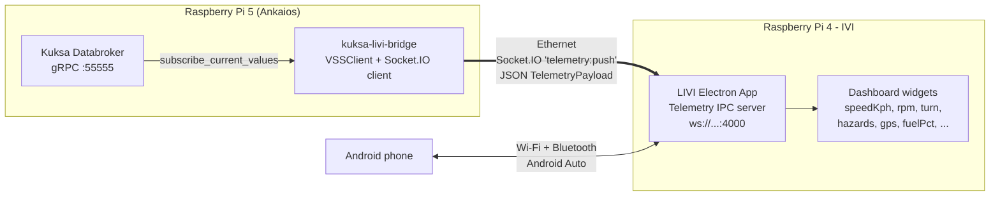

# IVI Head Unit (LIVI)

The demo includes an optional **In-Vehicle Infotainment (IVI)** subsystem running on a dedicated **Raspberry Pi 4** with a **7-inch touchscreen**. It hosts [LIVI](https://github.com/f-io/LIVI) — an open-source Apple CarPlay & Android Auto head unit built on Electron — and is wired into the rest of the demo via an **Ethernet** cable to the Raspberry Pi 5.

Live VSS data is fed into LIVI by the [Kuksa-to-LIVI Telemetry Bridge](./bridge-kuksa-livi.md), which runs as an Ankaios workload on the Pi 5 alongside the other signal workloads.

## Hardware

| Item | Notes |
| --- | --- |
| Raspberry Pi 4 (4 GB+) | Runs **Raspberry Pi OS Trixie** (required by LIVI for WebGL2) |
| 7" DSI / HDMI touchscreen | Boots LIVI fullscreen in kiosk mode |
| Ethernet cable | Connects to the Pi 5 / demo switch (`192.168.88.110`) |
| Built-in Wi-Fi + Bluetooth | Used to pair an **Android smartphone** for wireless Android Auto |
| Optional Carlinkit CPC200-CCPA dongle | Adds wireless Apple CarPlay support |

## Software installation

LIVI is installed on the Pi 4 with the upstream installer:

```bash
curl -fL -o install.sh \
  https://raw.githubusercontent.com/f-io/LIVI/main/scripts/install/pi/install.sh
chmod +x install.sh
./install.sh
```

## Component overview



LIVI exposes a Socket.IO endpoint on port `4000` (`ws://<livi-host>:4000`, event `telemetry:push`) that accepts batched [`TelemetryPayload`](https://github.com/f-io/LIVI/blob/main/src/main/shared/types/Telemetry.ts) JSON updates. The Pi 5 bridge publishes to this endpoint; LIVI merges each update into its central dashboard store and re-renders both the local cluster and any connected Android Auto / CarPlay receiver.

## Connectivity to the smartphone

The Pi 4 keeps two independent wireless stacks active toward the phone:

- **Wi-Fi** — used for the Android Auto data tunnel (high-bandwidth audio/video).
- **Bluetooth** — used for the wireless Android Auto handshake (pairing, Wi-Fi credentials exchange, audio fallback).

LIVI's native Android Auto adapter handles both. The Ethernet link to the Pi 5 is kept on a different subnet/interface so the bridge traffic never competes with Android Auto airtime.

## See also

- [Kuksa-to-LIVI Telemetry Bridge](./bridge-kuksa-livi.md) — VSS → LIVI mapping, signal transforms, composites, and operations.
- [MQTT-to-Kuksa gRPC Bridge](./bridge-mqtt-grpc.md) — counterpart ingest bridge (Mosquitto → Kuksa).
