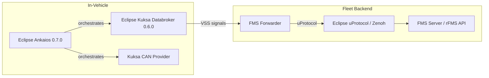

# E2E Demo Blueprint

## Vehicle E/E Architecture Demo

|                              |                                                                                                                                                                                                                                                                                                                              |
| ---------------------------- | ---------------------------------------------------------------------------------------------------------------------------------------------------------------------------------------------------------------------------------------------------------------------------------------------------------------------------- |
| **Short Summary**            | An end-to-end Vehicle E/E Architecture demo that combines the **Fleet Management** use case with an in-vehicle **MotorBike Blinker** use case. All signal names are aligned to the COVESA Vehicle Signal Specification (VSS), with Kuksa Databroker 0.6.0 running as an Eclipse Ankaios 0.7.0 workload.                       |
| **What is in the showcase**  | In-vehicle signal flow from physical driver inputs (joystick, RFID) through MQTT, gRPC and CAN to physical LED actuators, combined with fleet-level data collection, telemetry storage and analytics dashboards.                                                                                                             |
| **SDV Projects Involved**    | [Eclipse Kuksa](https://github.com/eclipse-kuksa), [Eclipse Ankaios](https://github.com/eclipse-ankaios), [Eclipse uProtocol](https://github.com/eclipse-uprotocol)                                                                                                                                                        |
| **Other Technologies**       | Arduino (Uno R4 WiFi), MCP2515 CAN transceiver, SocketCAN, Mosquitto MQTT, Podman, Docker Compose, InfluxDB 2.7, Grafana, Jakarta EE, Zenoh, ThreadX / Eclipse RTOS, SOME/IP                                                                                                                                                |
| **Target Hardware**          | Raspberry Pi 5, Raspberry Pi 4 (optional), Arduino Uno R4 WiFi (×2), MXChip AZ3166 (×2, optional)                                                                                                                                                                                                                           |
| **Source Repository**        | [eclipse-sdv-e2e-demo-blueprint](https://github.com/chheis/eclipse-sdv-e2e-demo-blueprint)                                                                                                                                                                                                                                  |

## Overview

This blueprint demonstrates a realistic vehicle E/E architecture where **physical driver inputs** control **physical actuators** through a modern software-defined vehicle (SDV) stack. It is designed for hands-on learning at workshops, hackathons and conference demos.

The demo integrates two complementary use cases:

1. **MotorBike Blinker** — A driver uses a joystick or RFID card to control turn indicators and a brake light on an 8-LED strip. Signals travel from Arduino ECUs over Wi-Fi/MQTT into Kuksa Databroker, then over CAN to a second Arduino that drives the LEDs.
2. **Fleet Management** — Vehicle telemetry from Kuksa Databroker is forwarded via Zenoh to a cloud-side stack with InfluxDB, Grafana dashboards and an rFMS HTTP API, complemented by a Jakarta EE analytics backend.

An optional **ThreadX SOME/IP extension** synchronises blinker and button state between two MXChip AZ3166 boards over Wi-Fi using OpenSOME/IP.

## Device Topology

The physical setup consists of up to six devices on the same Wi-Fi network:

| Device | Role | Key Software |
| --- | --- | --- |
| **Raspberry Pi 5** | Main compute node (HPC) | Ubuntu 24.04, Ankaios 0.7.0, Kuksa Databroker, Mosquitto, CAN Provider, Fleet Management stack |
| **Raspberry Pi 4** | Optional secondary HPC | Future split deployment target |
| **Arduino Uno R4 WiFi #1** | Joystick input ECU | MQTT publisher (VSS JSON) |
| **Arduino Uno R4 WiFi #2 + MCP2515** | LED control ECU | CAN listener, WS2812 LED driver |
| **Arduino + RC522 RFID** | Door/driver-ID ECU | MQTT publisher (driver UID) |
| **MXChip AZ3166 (×2)** | ThreadX SOME/IP peers (optional) | MQTT subscriber + SOME/IP bridge |

## Eclipse SDV Technologies Used

## Continue Reading

- [Architecture](./architecture) — Full component and communication architecture
- [Hardware Bill of Materials](./hardware) — Parts list for reproducing the demo
- [Raspberry Pi 5 Setup](./setup-guide) — Step-by-step setup instructions
- [VSS / CAN Signal Mapping](./signal-mapping) — How VSS signals map to CAN frames
- [Communication Workflow](./communication-workflow) — End-to-end signal flow
- [Fleet Analysis Backend](./fleet-analysis) — Jakarta EE analytics service

### Device Guides

- [Joystick Input ECU](./device-joystick-ecu) — Arduino joystick ECU setup and configuration
- [LED Control ECU](./device-led-ecu) — CAN-connected LED strip controller
- [RFID Door ECU](./device-rfid-ecu) — Driver identification via RFID
- [ThreadX SOME/IP ECU](./device-threadx-ecu) — Optional MXChip AZ3166 SOME/IP extension
