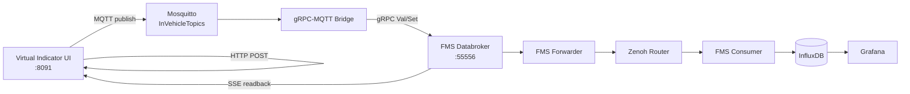

# Virtual Setup

The virtual setup runs the E2E Demo Blueprint without physical ECUs or CAN hardware. It replaces the joystick, RFID door reader, and LED-strip actuator with a browser-based **Virtual Indicator UI** while keeping the rest of the signal flow and Fleet Management stack intact.

## What it replaces

The physical setup normally uses:

- Arduino joystick ECU for left/right indicator input
- Arduino RFID ECU for driver identification
- Arduino + MCP2515 LED ECU for brake and indicator output

The virtual setup replaces those devices with:

- `virtual-indicator-ui` for left/right/brake input and driver ID publishing
- live SSE-based actor view for the 8-LED strip representation
- Docker Compose networking instead of Ankaios + host networking

## Stack overview

The setup is started with [`virtual-setup/start-virtual-setup.sh`](../../virtual-setup/start-virtual-setup.sh).
It starts Fleet Management first, then starts [`virtual-setup/virtual-e2e-compose.yaml`](../../virtual-setup/virtual-e2e-compose.yaml), which joins the external Docker networks created by Fleet Management.

Virtual compose services:

- `mosquitto`
- `grpc-mqtt-bridge`
- `virtual-indicator-ui`
- `pi5-demo-website`

Fleet Management services (started from `external/fleet-management` compose files):

- `databroker`
- `fms-forwarder`
- `fms-zenoh-router`
- `fms-consumer`
- `influxdb`
- `grafana`
- `fms-server`
- `fleet-analysis-backend`

## Signal flow



## Start from scratch

From the repository root:

```bash
bash virtual-setup/stop-virtual-setup.sh
bash virtual-setup/start-virtual-setup.sh
```

Port usage note:

- Inside Docker `fms-vehicle`, use `databroker:55556`.
- From the host, Databroker is exposed as `localhost:55555`.

## Access the services

| Service | URL |
| --- | --- |
| Virtual Indicator UI | `http://localhost:8091` |
| Demo website | `http://localhost:8090` |
| Grafana | `http://localhost:3000` |
| rFMS API | `http://localhost:8081` |
| Fleet Analysis API | `http://localhost:8082/fleet-analysis/api/analysis/stats` |

## Notes

- The virtual setup reuses Fleet Management assets from `external/fleet-management`.
- `fms-consumer`, not `fms-forwarder`, is the service that writes telemetry into InfluxDB.
- The virtual setup is intended for local development, demos, and CI-style validation where physical hardware is unavailable.
